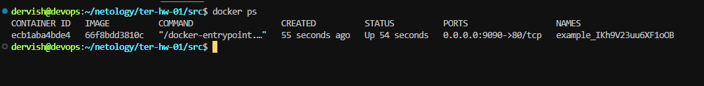
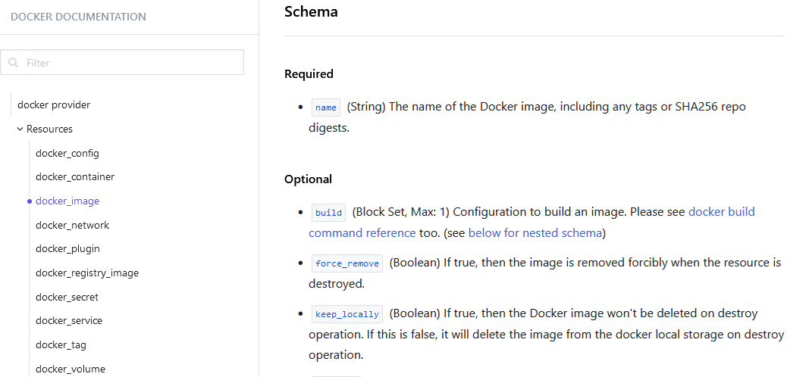

Проверка версии установленного terraform.

## Задача 1

1. Скачиваем все необходимые зависимости, использованные в проекте..

2. Изучите файл .gitignore. В каком terraform-файле, согласно этому .gitignore, допустимо сохранить личную, секретную информацию?(логины,пароли,ключи,токены итд)
>Ответ: в файле personal.auto.tfvars

3. Выполните код проекта. Найдите в state-файле секретное содержимое созданного ресурса random_password, пришлите в качестве ответа конкретный ключ и его значение.

>Ответ: "result": "IKh9V23uu6XF1oOB"

4. Раскомментируйте блок кода, примерно расположенный на строчках 29–42 файла main.tf. Выполните команду terraform validate. Объясните, в чём заключаются намеренно допущенные ошибки. Исправьте их.

>Ответ: в блоке resource "docker_image" отсутствует имя ресурса, в блоке resource "docker_container" имя ресурса начинается с цифры, что недопустимо, также в этом блоке аргументу name присваивается несуществующее свойство.

5. Выполните код. В качестве ответа приложите: исправленный фрагмент кода и вывод команды docker ps

>Правильно должно быть, например, так

6. Замените имя docker-контейнера в блоке кода на hello_world. Не перепутайте имя контейнера и имя образа. Мы всё ещё продолжаем использовать name = "nginx:latest". Выполните команду terraform apply -auto-approve. Объясните своими словами, в чём может быть опасность применения ключа -auto-approve. Догадайтесь или нагуглите зачем может пригодиться данный ключ? В качестве ответа дополнительно приложите вывод команды docker ps

>Ответ: При запуске с флагом -auto-approve terraform создает план на основе изменений, внесенных в инфраструктуру. Это делает использование -auto-approve флага очень опасным, поскольку некоторые ошибки могут привести к безвозвратной потере данных или уничтожению вашей базы данных. И это будет сделано без вашего согласия. Ключ -auto-approve может пригодиться для тестирования, удаления временных ресурсов и для использования в CI/CD

7. Уничтожьте созданные ресурсы с помощью terraform. Убедитесь, что все ресурсы удалены. Приложите содержимое файла terraform.tfstate.

8. Объясните, почему при этом не был удалён docker-образ nginx:latest. Ответ ОБЯЗАТЕЛЬНО НАЙДИТЕ В ПРЕДОСТАВЛЕННОМ КОДЕ, а затем ОБЯЗАТЕЛЬНО ПОДКРЕПИТЕ строчкой из документации terraform провайдера docker.

>Ответ: docker-образ nginx:latest не был удален из локального хранилища из-за установленной опции keep_locally = true. Если необходимо удалять обзаз из локального хранилища при уничтожении ресурсов - значение этой опции следует выставить в false

>как указано в документации

## Задача 2

Весь необходимый код находится в [папке](./task2/)

Результат выполнения

